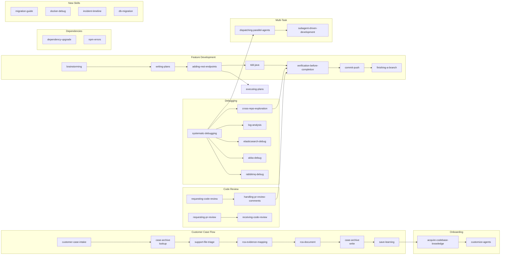

# Skill Dependency Graph

<!-- Auto-generated reference — update when adding new skills or changing Inter-Skill References -->

## Mermaid Diagram

## Skill Reference Table

| Skill | Depends On | Depended By |
|-------|-----------|-------------|
| `acquire-codebase-knowledge` | — | `customize-agents`, `save-learning` |
| `adding-rest-endpoints` | `writing-plans` | `tdd-java` |
| `akka-debug` | `systematic-debugging` | — |
| `brainstorming` | — | `writing-plans` |
| `case-archive` | `rca-document` | `save-learning` |
| `commit-push` | `verification-before-completion` | `finishing-a-branch` |
| `cross-repo-exploration` | `systematic-debugging` | `verification-before-completion` |
| `customer-case-intake` | — | `case-archive`, `support-file-triage` |
| `customize-agents` | `acquire-codebase-knowledge` | — |
| `db-migration` | — | — |
| `dependency-upgrade` | — | — |
| `dispatching-parallel-agents` | — | `subagent-driven-development` |
| `docker-debug` | — | — |
| `elasticsearch-debug` | `systematic-debugging` | — |
| `executing-plans` | `writing-plans` | — |
| `finishing-a-branch` | `commit-push` | — |
| `handling-pr-review-comments` | `requesting-code-review` | `verification-before-completion` |
| `incident-timeline` | — | — |
| `log-analysis` | — | `systematic-debugging` |
| `migration-guide` | — | — |
| `npm-errors` | — | — |
| `rabbitmq-debug` | `systematic-debugging` | — |
| `rca-document` | `rca-evidence-mapping` | `case-archive` |
| `rca-evidence-mapping` | `support-file-triage` | `rca-document` |
| `receiving-code-review` | — | — |
| `requesting-code-review` | — | `handling-pr-review-comments` |
| `requesting-pr-review` | — | `receiving-code-review` |
| `save-learning` | `case-archive` | — |
| `subagent-driven-development` | `dispatching-parallel-agents` | — |
| `support-file-triage` | `customer-case-intake` | `rca-evidence-mapping` |
| `systematic-debugging` | — | `cross-repo-exploration`, `elasticsearch-debug`, `akka-debug`, `rabbitmq-debug` |
| `tdd-java` | `adding-rest-endpoints` | `verification-before-completion` |
| `tdd-react` | — | `verification-before-completion` |
| `verification-before-completion` | — | `commit-push` |
| `writing-plans` | `brainstorming` | `adding-rest-endpoints`, `executing-plans` |
